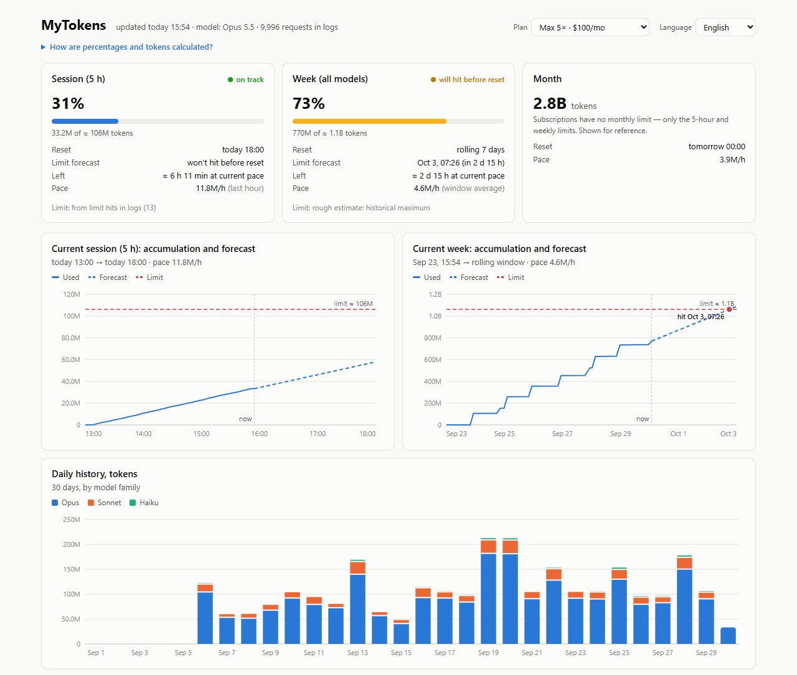

# MyTokens

**How much of your Claude limits is left — and when you'll run out.**

MyTokens shows how much of your 5-hour session limit and weekly limit you have used, when each one resets, and whether you will hit the limit before the reset at your current pace. It also shows your usage history, what extra usage would cost at API prices, and how much your subscription saves compared with paying per token.



*The screenshot uses generated sample data.*

## How to use it

Ask Claude in your own words — "how much of my limit is left?", "when will I hit the limit?" — or use a command in Claude Code:

| Command | What it does |
|---|---|
| `/mytokens:dashboard` | Summary in the chat and a dashboard with charts in your browser |
| `/mytokens:status` | Summary table in the chat only |
| `/mytokens:calibrate` | Fine-tune the limits with the numbers from `/usage` |
| `/mytokens:setup` | Set your plan (Pro, Max 5×, Max 20×, Team, API) |
| `/mytokens:language` | Switch language: English, Русский, Español, 中文, Français, Deutsch, Português |

## Two modes

**Full mode — Claude Code on your computer, with Python 3.** MyTokens reads the usage counters that Claude Code already keeps on your machine and needs no input from you. You get the percentages, the forecast, history by day and by 5-hour window, a per-model breakdown, the dashboard, and the plan-versus-API comparison. The limits are learned from the moments you actually hit a limit (they are recorded in the same logs), or from a one-time calibration with `/usage`.

**Numbers mode — everywhere else.** In the claude.ai chat, the desktop and mobile apps, or Claude Code without Python, send Claude a screenshot of **Settings → Usage** (or the numbers from it). MyTokens works out when you will hit each limit at your pace since the window started. There is no history or per-model breakdown in this mode, because that data only exists on the computer where you use Claude Code.

## Requirements

- Numbers mode: nothing to install.
- Full mode: Python 3.8 or newer. Only the standard library is used — no packages to install. If Python is missing, MyTokens falls back to numbers mode and tells you how to install it (Windows: `winget install Python.Python.3.12`; macOS: `xcode-select --install`; Linux: the `python3` package).

## Install

In Claude Code:

```
/plugin marketplace add vknyaz-afk/mytokens
/plugin install mytokens@mytokens
```

On claude.ai you can add the plugin from **Customize → Plugins**.

## Data and privacy

- **What it reads.** In full mode, MyTokens reads Claude Code's local session logs in `~/.claude/projects/` and keeps only the usage metadata: token counts, model names, timestamps, and the text of "you've hit your limit" messages. It does not keep or analyse the content of your conversations.
- **What it writes.** Its settings, a cache of those counters, and the generated `dashboard.html` go to `~/.claude/mytokens/` on your computer. The dashboard opens from that local file in your browser.
- **What it sends.** Nothing. MyTokens makes no network requests and has no server. In numbers mode, the screenshot or numbers you give Claude stay in your conversation like any other message.
- **Accuracy.** Local logs only include Claude Code on that computer. Usage in the claude.ai chat or on other devices shares the same limits but isn't in those logs; calibrating once with `/usage` accounts for it. Anthropic doesn't publish subscription limits in tokens, so MyTokens measures them in tokens weighted by each model's API price and converts them to your usual mix of models and cache.

## License

[MIT](LICENSE)
